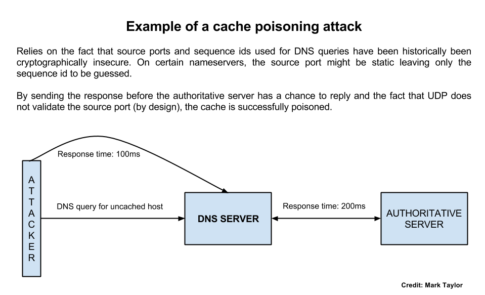

DNS Cache Poisoning
===================

This is a placeholder for a great PDF that goes in depth into DNS cache poisoning attacks and how to identify them on nameservers.

https://labs.nic.cz/files/labs/DNS-cache-poisoning-attack-analysis.pdf

### Practical advice

- Use Nessus to identify vulnerabilities
- Manually verify using dig

### Simple illustration of a cache poisoning attack

This illustration was shown to me by a colleague at work making it clear how a cache poisoning attack related to insecure/static source ports and sequence id works.

