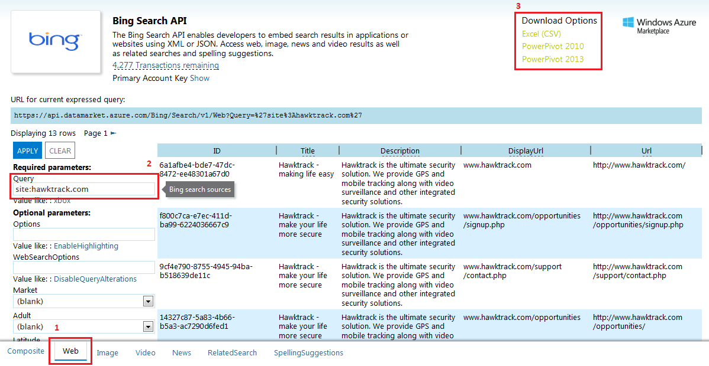

Bing Search
===========

Bing is great for doing recon on pentests. My usual trickery is to use `site:<HOST>` or  `ip:<IP_ADDRESS>`. In fact, Google does not even support searching by IP address anymore. Additionally, you can also search for certain components used by a site using `inurl:<QUERY>`. This is useful for identifying other sites that might be using the same component to identify any vulnerabilities or default pages that might exist on the target host.

### Quick and dirty

Obviously, the easiest way to use Bing is to go to <bing.com>. However, when there are too many results, that can become cumbersome. So, the easiest way is to use the Bing Search API explorer and export all the results in one go.

The screenshot below shows sample output and the process for generating the output. While only a maximum of 50 results are shown at a time, using the DOwnload option downloads the whole set (the maximum I've exported is 415).

Link: <https://datamarket.azure.com/dataset/explore/5BA839F1-12CE-4CCE-BF57-A49D98D29A44>

__Note:__ You will need to register to use the Bing Search API at <http://datamarket.azure.com/dataset/bing/search> before you can use the Bing API Explorer.

### Complex requirements

In some pentests, the scope might be the whole parent domain or a block of IP addresses. In this case, the above method falls short as you will need to recursively perform the same search for new hosts as they are identified while ensuring duplicates are removed.

- [ ] Generalise the Bing Search script and add here with instructions on how to use
- [ ] Include an example scenario here
