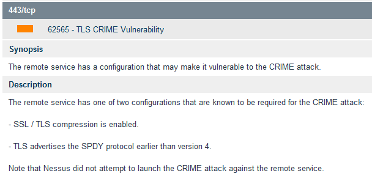
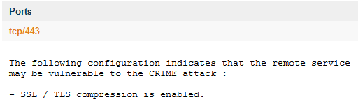
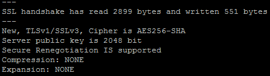

TLS CRIME Vulnerability
=======================

### Nessus Plugin:
<http://www.tenable.com/plugins/index.php?view=single&id=62565>

A Nessus output related to CRIME looks like below. Make sure you look for the reason to check whether it is SPDY or SSL compression that is the problem.

### Verifying the finding
The vulnerability can be verified by using OpenSSL

#### Test 1
Connect to the host using OpenSSL using `openssl s_client -connect *<HOST>*:*<PORT>*`. Look for the line which starts with compression. If the website is not vulnerable, this value should be *NONE*. A sample output is shown below.

What you will notice is that OpenSSL creates an active connection with the host. At this point, try the second check.

#### Test 2
Go to this awesome blog for the second test - <https://scottlinux.com/2012/09/13/enable-or-disable-compression-in-apache/>
If the link doesn't work, use the archive stored here - <./__link_archive/scottlinux.com _ Linux Blog - Enable or Disable Compression in Apache.htm>