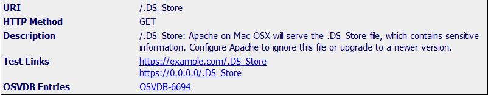
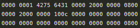
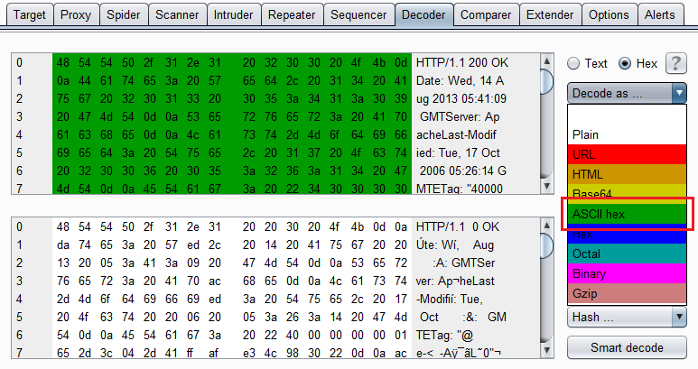
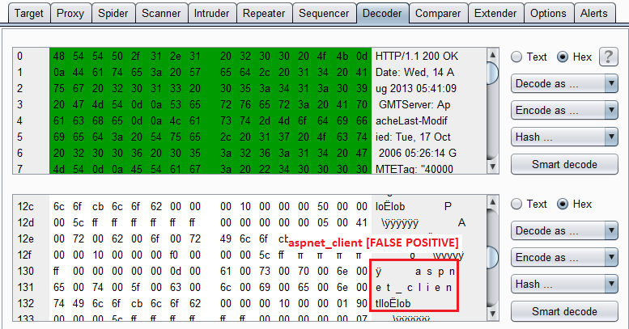
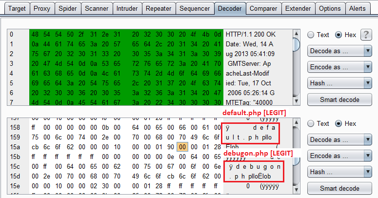

DS_Store on a webserver
=======================

I came across this the other day in Nikto. It seemed

### Background

You may have seen the __.DS_Store__ file on your Windows or Mac machine but ignored it. However, this file is really interesting from a security point of view when testing remote systems. SecurityFocus provides a great explanation on what is stored in a .DS_Store file and how it may be helpful to attackers looking to compromise a web server.

> A remote attacker may read obtain web directory content information by submitting a URL to the vulnerable host's web service of the following form:

> <http://www.example.com/target_directory/.DS_store>

> This information could provide an attacker with sensitive information including system configuration, installed applications, etc. Properly exploited, this information could allow an attacker to further compromise the security of the host. 

>	 - <http://www.securityfocus.com/bid/3324/discuss>

I can think of two reasons why this file might exist:
- First one is obvious, the remote machine is running OS X.
- A user has copied over a directory from their own computer which contained a __.DS_Store__ file. In this case, any changes made to the directory structure may not be reflected in the .DS_Store and you may find entries that seem to not exist on the server.

### Vulnerability Analysis

I actually didn't know about this vulnerability until Nikto picked it up on one of the hosts I was testing. Interestingly, DirBuster does not have this file in any of its directory lists so you are unlikely to pick this up unless you run Nikto. A sample output from Nikto looks like below:

### Exploitation

Unfortunately, there is not much information on how to use this vulnerability to exploit a remote system. Opening the file in a basic text editor might look like below.

Obviously, this isn't exactly human readable. Luckily, it is as simple as opening the __.DS_Store__ file in a hex editor and looking at its contents. I personally use Burp since I use it for my normal web testing. Process for Burp includes outputting the response body to the Decoder tab and decoding it as "Ascii Hex" like shown below.

The output might still seem undecipherable and for the most part I am not quite sure what it stores. There's also a lot of null bytes in the file. What you should be looking for are certain decipherable text that might sound like a file or directory name. I've shown below two screenshots from a .DS_Store file I found on an engagement (modified).

### Exercise

- [ ] Add a sample DS_Store file and its answerss